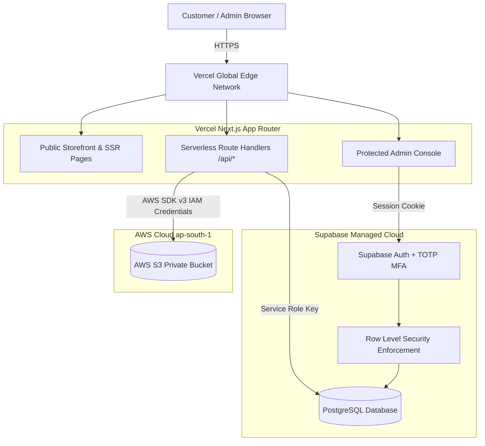
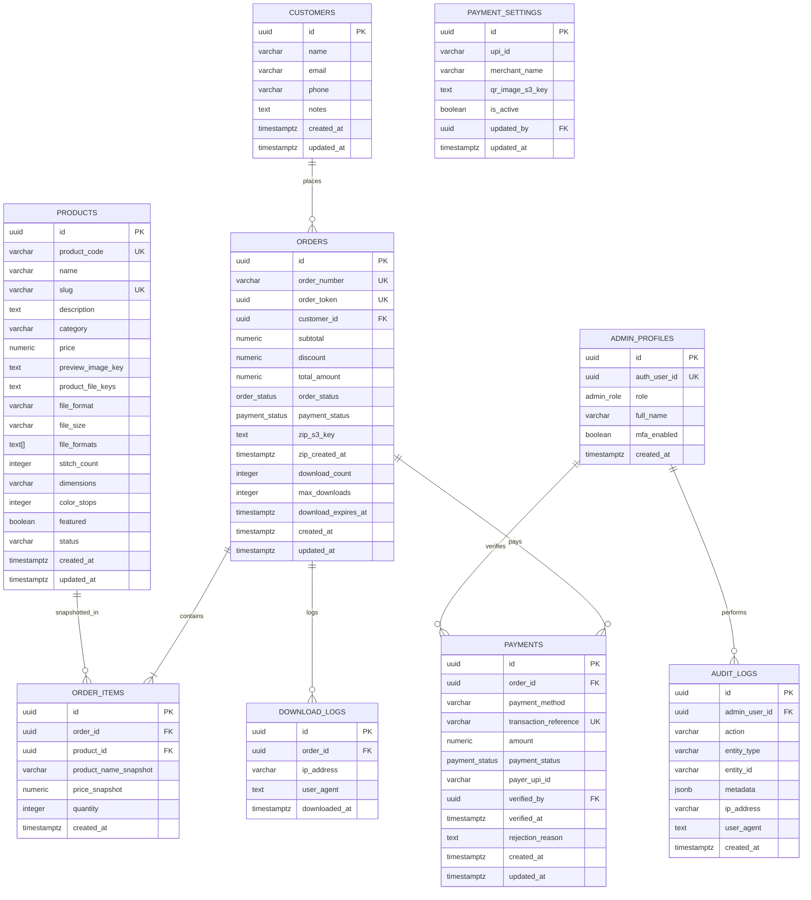
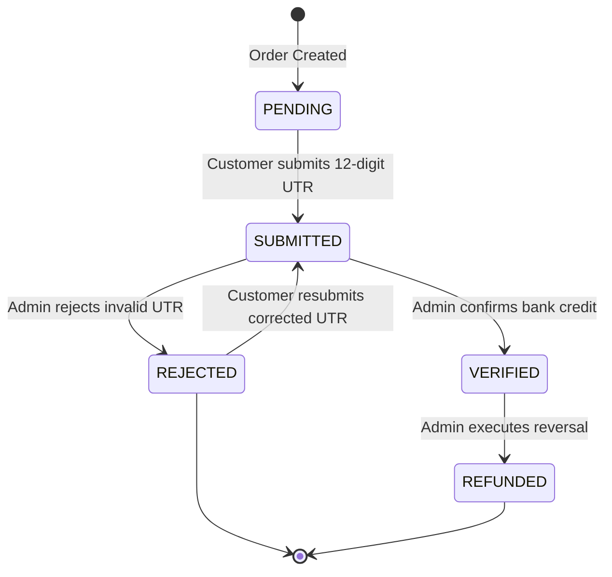
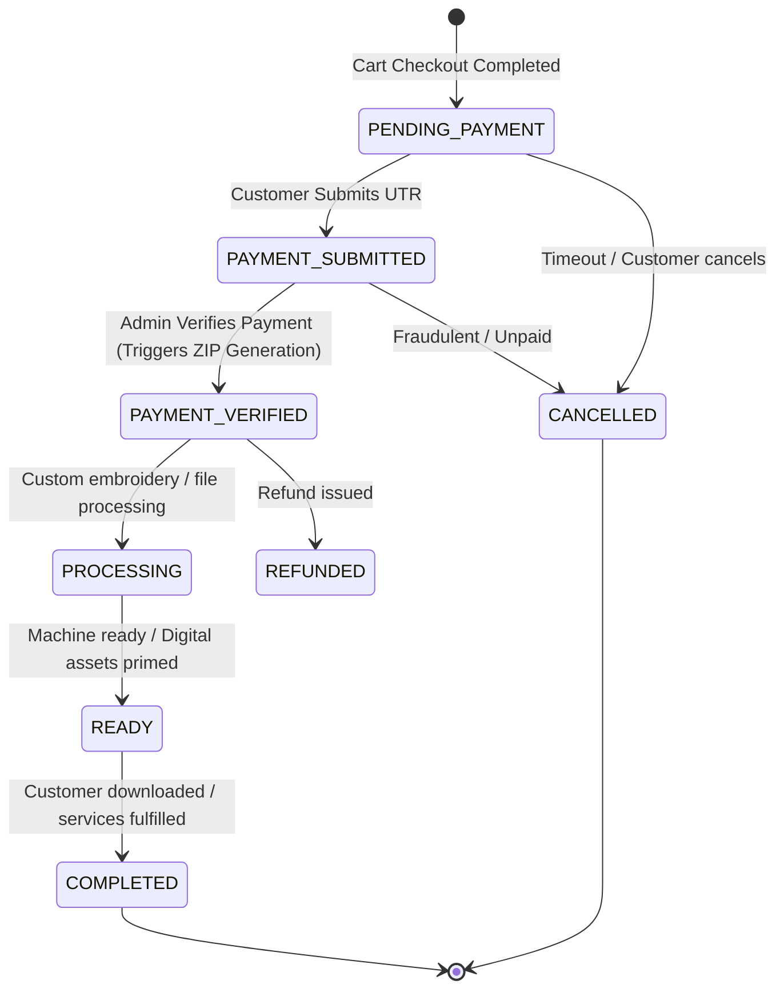

# Madhus Boutique: Architecture Specification & System Design

**Version:** 1.0.0  
**Target Environment:** Vercel Serverless + Supabase PostgreSQL + AWS S3 Private Storage  
**Author:** Lead Software Architect & Senior Full-Stack Engineer  

---

## 1. Architecture Document

Madhus Boutique is a production-grade, serverless digital e-commerce and bespoke embroidery services platform. 

### High-Level Topology



### Architectural Principles
1. **Zero-Trust Client**: The browser is strictly a display terminal. It never calculates totals, verifies payments, or touches private S3 credentials.
2. **Private-by-Default Storage**: S3 Block Public Access is permanently enabled. All downloads are served through time-limited (5-minute) pre-signed URLs.
3. **Immutable Order Snapshots**: Prices, item names, and totals are locked into `order_items` at checkout time, preventing retroactive price changes from affecting historical records.
4. **Zero Cold-Server Maintenance**: 100% serverless on Vercel and managed cloud services. No EC2, VPS, or container orchestration overhead.

---

## 2. Database ERD



---

## 3. Data Model

| Entity | Primary Key | Critical Constraints | Indexes |
| :--- | :--- | :--- | :--- |
| `products` | `id` (UUID) | `product_code` UNIQUE, `slug` UNIQUE, `price >= 0` | `category`, `status`, `product_code`, `slug` |
| `customers` | `id` (UUID) | `email` format valid, `phone` format valid | `phone`, `email` |
| `orders` | `id` (UUID) | `order_number` UNIQUE, `order_token` UNIQUE | `order_number`, `order_token`, `customer_id`, `order_status` |
| `order_items` | `id` (UUID) | `quantity > 0`, `price_snapshot >= 0` | `order_id`, `product_id` |
| `payments` | `id` (UUID) | `transaction_reference` UNIQUE (when not null) | `order_id`, `transaction_reference` |
| `payment_settings` | `id` (UUID) | Only 1 record with `is_active = true` permitted | `is_active` |
| `admin_profiles` | `id` (UUID) | `auth_user_id` matches `auth.users(id)` | `auth_user_id`, `role` |
| `audit_logs` | `id` (UUID) | Append-only (no updates/deletions allowed) | `created_at DESC`, `admin_user_id` |
| `download_logs` | `id` (UUID) | Append-only | `order_id`, `downloaded_at DESC` |

---

## 4. Security Model

1. **Defense in Depth**:
   - Web application layer (Rate limiting, Zod schema validation, CSRF headers).
   - Serverless mediation (No direct database connections from the browser).
   - Database layer (PostgreSQL Row Level Security).
   - Storage layer (AWS IAM least privilege + AWS S3 Block Public Access).
2. **Secret Separation**:
   - `NEXT_PUBLIC_*`: Only contains non-secret domain and styling constants.
   - `SUPABASE_SERVICE_ROLE_KEY`: Guarded inside server-only route handlers.
   - `AWS_SECRET_ACCESS_KEY`: Server-only; IAM policy limits actions to `s3:GetObject`, `s3:PutObject`, `s3:DeleteObject` within `arn:aws:s3:::madhus-boutique-private/*`.
3. **Row Level Security (RLS)**:
   - `products`: `SELECT` allowed for `anon` where `status = 'ACTIVE'`.
   - `orders`, `order_items`, `payments`, `customers`: 0 public `SELECT`, `INSERT`, `UPDATE`, `DELETE` permissions. Accessible exclusively via the server-side `service_role`.
   - `admin_profiles`, `audit_logs`: Accessible only to authenticated admins matching valid session JWTs.

---

## 5. Route / API Specification

### Public Client Routes
* `GET /api/catalog/products`: List active products with category filtering.
* `GET /api/catalog/products/[slug]`: Get detailed product specifications.
* `POST /api/checkout/create-order`: Submit cart and guest customer profile. Recalculates prices server-side, generates `order_number` and `order_token`.
* `POST /api/checkout/submit-payment`: Submit 12-digit UPI UTR reference for an order.
* `GET /api/orders/track`: Query order status with `orderNumber` + phone or token.
* `POST /api/orders/download`: Request 5-minute pre-signed S3 download URL for verified order.

### Protected Admin Routes (Requires Supabase Auth Session + RBAC Check)
* `GET /api/admin/dashboard/stats`: KPI metrics (revenue, orders, pending reviews).
* `GET /api/admin/orders`: Paginated order search & status filters.
* `POST /api/admin/orders/[id]/verify-payment`: Verify payment, trigger ZIP creation, transition order to `PAYMENT_VERIFIED`.
* `POST /api/admin/orders/[id]/status`: Update workflow status (`PROCESSING`, `READY`, etc.).
* `GET /api/admin/payments`: Review pending/verified transaction references.
* `PUT /api/admin/settings/payment-qr`: Update active UPI ID / QR (Requires Super Admin + Audit Log).
* `POST /api/admin/products`: Create/update embroidery product & upload assets.
* `GET /api/admin/audit-logs`: Audit trail browser.

---

## 6. S3 Object Structure

Bucket: `madhus-boutique-private` (Block Public Access: ON)

```
madhus-boutique-private/
│
├── products/
│   ├── MB-001/
│   │   ├── preview/
│   │   │   └── watermarked-preview.webp
│   │   └── files/
│   │       ├── MB-001.dst
│   │       ├── MB-001.pes
│   │       ├── MB-001.jef
│   │       └── MB-001-color-chart.pdf
│   └── MB-002/
│       ├── preview/
│       └── files/
│
├── orders/
│   └── MB-20260923-00001/
│       └── downloads/
│           └── MadhusBoutique-MB-20260923-00001.zip
│
└── payment/
    └── qr/
        └── active-merchant-qr.png
```

---

## 7. Authentication Model

* **Customer Authentication**: Frictionless Guest Mode. Identity is bound by `order_number` + cryptographic `order_token` (UUID v4) + verified Phone/Email.
* **Admin Authentication**:
  1. Primary: Supabase Auth (Email + Secure Password via Argon2/Bcrypt hash).
  2. Secondary: **TOTP MFA** (RFC 6238 via Google Authenticator, Microsoft Authenticator).
  3. Session: HTTP-only, `SameSite=Lax`, `Secure` JWT cookies handled via `@supabase/ssr`.

---

## 8. Authorization / RBAC Model

| Resource / Capability | Public Guest | Content Manager | Order Manager | Super Admin |
| :--- | :---: | :---: | :---: | :---: |
| View Active Products | ✅ | ✅ | ✅ | ✅ |
| Create Order / Submit UTR | ✅ | ❌ | ❌ | ❌ |
| Download Verified Design | ✅ (with Token) | ❌ | ❌ | ❌ |
| Create / Edit Products | ❌ | ✅ | ❌ | ✅ |
| Upload S3 Embroidery Files | ❌ | ✅ | ❌ | ✅ |
| Verify Payments | ❌ | ❌ | ✅ | ✅ |
| Change Order Status | ❌ | ❌ | ✅ | ✅ |
| Send WhatsApp Update | ❌ | ❌ | ✅ | ✅ |
| Modify UPI QR Settings | ❌ | ❌ | ❌ | ✅ |
| View System Audit Logs | ❌ | ❌ | Limited | ✅ |

---

## 9. Payment State Machine



---

## 10. Order State Machine



---

## 11. Threat Model

| Threat | Attack Vector | Severity | Mitigation Strategy |
| :--- | :--- | :--- | :--- |
| **Price Tampering** | Manipulating cart JSON in browser before checkout API call. | High | Server recalculates every item subtotal using `products.price` from PostgreSQL. Client price fields are ignored. |
| **UTR Replay Attack** | Submitting a previously used 12-digit UTR on a new order. | High | Database `UNIQUE` constraint on `payments.transaction_reference` prevents duplicate UTR entries. |
| **Digital Asset Theft** | Scraping public S3 URLs or reverse-engineering stitch paths. | Critical | S3 Block Public Access ON; 5-minute pre-signed URLs; previews watermarked and downscaled to 800px. |
| **IDOR Order Access** | Incrementing order numbers (`MB-001` -> `MB-002`) to download designs. | Critical | Order downloads strictly require unguessable `order_token` UUID match + verification checks. |
| **Serverless Execution Timeout** | Generating large multi-file ZIP on demand during download request. | Medium | Pre-generate bundle ZIP once at payment verification and stream with `archiver` directly into S3. |
| **Admin Brute Force** | Dictionary attack on admin login endpoint. | High | Rate limiting on auth endpoints + TOTP MFA requirement. |
| **Admin QR Hijack** | Malicious insider changing UPI ID to redirect customer funds. | Critical | Restricted to Super Admin role; requires MFA re-authentication; triggers high-priority audit log. |

---

## 12. Project Folder Structure

```
d:/Madhusboteque/
├── .env.example
├── AGENTS.md
├── next.config.ts
├── package.json
├── tsconfig.json
├── docs/
│   ├── ARCHITECTURE_SPEC.md
│   └── s3-security-policy.json
├── supabase/
│   └── migrations/
│       ├── 20260923000000_init_schema.sql
│       └── 20260923000001_seed_data.sql
├── types/
│   ├── database.ts
│   └── store.ts
└── src/
    ├── app/
    │   ├── globals.css
    │   ├── layout.tsx
    │   ├── page.tsx                           # 1. Home
    │   ├── designs/
    │   │   ├── page.tsx                       # 2. Design catalogue
    │   │   └── [slug]/
    │   │       └── page.tsx                   # 3. Product details
    │   ├── services/
    │   │   └── page.tsx                       # 4. Services
    │   ├── about/
    │   │   └── page.tsx                       # 5. About
    │   ├── contact/
    │   │   └── page.tsx                       # 6. Contact
    │   ├── cart/
    │   │   └── page.tsx                       # 7. Cart
    │   ├── checkout/
    │   │   └── page.tsx                       # 8. Checkout UI
    │   ├── track-order/
    │   │   └── page.tsx                       # 9. Track Order UI
    │   ├── order/
    │   │   └── [orderNumber]/
    │   │       └── page.tsx                   # Order Confirmation & Status
    │   └── not-found.tsx
    ├── components/
    │   ├── layout/
    │   │   ├── Header.tsx
    │   │   ├── Footer.tsx
    │   │   └── WhatsAppBubble.tsx
    │   ├── storefront/
    │   │   ├── HeroBanner.tsx
    │   │   ├── ProductCard.tsx
    │   │   ├── CategoryFilter.tsx
    │   │   ├── SearchBar.tsx
    │   │   └── FormatBadge.tsx
    │   ├── cart/
    │   │   ├── CartDrawer.tsx
    │   │   └── CartItemRow.tsx
    │   ├── ui/
    │   │   ├── badge.tsx
    │   │   ├── button.tsx
    │   │   ├── card.tsx
    │   │   ├── dialog.tsx
    │   │   └── input.tsx
    │   └── shared/
    │       ├── EmptyState.tsx
    │       ├── LoadingSkeleton.tsx
    │       └── WatermarkPreview.tsx
    ├── context/
    │   └── CartContext.tsx
    ├── data/
    │   └── mockProducts.ts                    # Realistic mock embroidery designs
    └── lib/
        └── utils.ts
```

---

## 13. Sprint Plan

* **Sprint 0: Architecture & Specs (COMPLETED)**:
  - System architecture document, database schema, types, IAM policies, and threat model.
* **Sprint 1: Public Storefront UI with Mock Data (ACTIVE EXECUTION)**:
  - Implement complete public-facing responsive UI: Home, Catalogue, Details, Services, About, Contact, Cart Drawer, Checkout UI, Order Status, Track Order.
  - Zero fake backend security or mock payment verification; pure, clean, accessible storefront with real client cart state and realistic embroidery data.
* **Sprint 2: Supabase Integration & RLS**:
  - Connect live Supabase DB, run migrations, enforce RLS policies, setup Supabase SSR client.
* **Sprint 3: Private S3 Storage & Asset Pipeline**:
  - AWS SDK v3 integration, watermarking preview generator, pre-signed URL services.
* **Sprint 4: Cart & Order Creation Engine**:
  - Server-side price snapshotting, order number generation, guest customer creation.
* **Sprint 5: UPI Payment & Admin Verification**:
  - Dynamic UPI QR generation, UTR submission API, admin verification interface.
* **Sprint 6: Digital Delivery & Serverless ZIP Archiving**:
  - Direct memory streaming ZIP creation, S3 bundle storage, expiring pre-signed downloads.
* **Sprint 7: Protected Admin Console & RBAC**:
  - Admin dashboard, TOTP MFA, order status manager, QR settings editor, WhatsApp click-to-message.
* **Sprint 8: Hardening & Production Launch**:
  - Penetration testing, rate limiting, billing alerts, SEO audit, production build.
